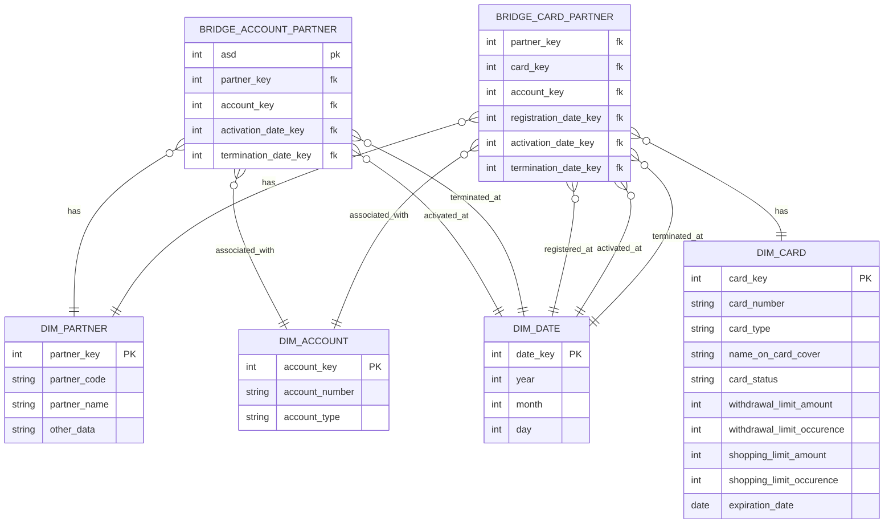

# Planned Data model

## Business process

We have 3 different business processes that we can represent.
1. Assignment, revocation, and change of a bank account under a client, or vice versa.
2. Assignment, revocation, and change of a card under a natural person.
3. Change of relationship between natural persons and their representatives.

## Known Relationship Problems

1. Foreign key points to an invalid value
    1. Cause: The record with the foreign key was uploaded before the row we're pointing to
    2. Solution: Add the relation to the bridge table. The data will indicate that this row has no data yet. Maybe add
       a missing data flag.
2. Foreign key is null
   1. Cause: Upstream DQ fail.
   2. Solution 1: Send these rows into a separate failure table.
   3. Solution 2: Create a dummy row in the client table for unknown clients. The rows in the bridge table point to
      that client.