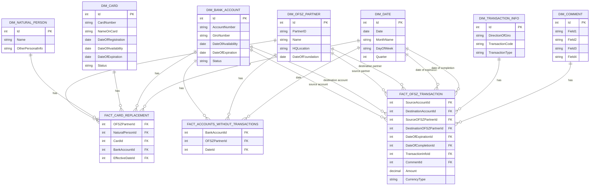

# Planned Data model

## 2 types of problems

We have 2 proposed data models, and the biggest question between them is: How much we care about historical inventory?
I took on the ofsz transaction facts into account as well, since
the dimensions defined here will hook onto that one.

### Two correlated facts - inventory and transactions

Let's start with our inventory. We can model the following business processes:

1. Bank account registration and expiration, connected to a business partner.
2. Card registration, change, and expiration, connected to a bank account and a natural person.

As you can see, they already show us two different granularities, and 4 types of connection:

1. Bank Account &lrarr; Business Partner
2. Bank Account &lrarr; Bank Card
3. Bank Card  &lrarr; Natural Person
4. Natural Person &lrarr; Business Partner

They can either be represented in one giant "log" table, or their separate tables - as before

As for our transaction table, it's simple. Each row represents
a transaction made on one of our Bank Accounts, on a given day, with the given transaction, and counterpart info.

Now the counterpart also has a bank account, which can be an OFSZ account, or an external one.
We can handle this case by either creating a different bank account table, or integrating it to our bank account table.

Knowing this, we can start with our two proposals.

## 1. Inventory acts as a bridge table between dimensions

In this model, we'll only keep reference to the bank account data in our transaction table
and do every connection through our bridge table to get to different levelt.
The bridge table will have a new row if:

1. Bank card gets registered, changed or revoked
2. Bank account gets registered or revoked

So while getting a history of card changes is simple, some parts are more difficult:

1. Which partner does this account belong to? (group by account, get the row with last effective date)
2. If this table has multiple cards for each account, how do we know which card the given transaction belongs to?
   (It doesn't belong to any transaction -> misleading for new people)

So you can see, this bridge table does a lot of heavy lifting, which can be (IMO) solved simpler,
if we take the following facts into account:

1. Cards are irrelevant to our transactions
2. A bank account can only ever belong to 1 business partner -> the relationship can be encoded in the facts
3. We do actually need a card history, but it's only a secondary fact.
4. If we need bank accounts without transactions, we can get a factless fact table.

So let's get on to our second proposal

## 2. Inventory is a separate process

We've done a minimal change, with big impact. Now everything that is related to our transactions can be found on one level.
Furthermore, we can simply query which accounts have had no transactions up to date x, and card changes are a fully separate
process -> That fact table can also be simpler.

## Mapping

### Dimensions

1. OFSZ Partner
   1. IM_BI.Ugyfel
   2. IM_BI.UGYFET -> Type != 'M'
   3. There'll be keys only present in one table -> outer join
2. Natural Person
   1. IM_BI.UGYFET -> Type == 'M'
3. Card
   1. Oracle.CardInfo
   2. IM_BI.KARTYA
   3. Expiration date differs -> Take the lower one
   4. Expiration date and status doesn't always correspond -> Ask financial dept.
4. Account
   1. IM_BI.BANKSZAMLA
   2. IM_BI.TRZ
   3. Outside bank accounts will be represented, with info pointing that they don't belong to us.
5. Transaction Info
   1. IM_BI.TRZ
6. Comment
   1. IM_BI.TRZ

### Facts

1. Card Change
   1. ORACLE_BI.CARD_HISTORY
2. Transaction
   1. IM_BI.TRZ
   2. IM_BI.BANKSZAMLA
   3. OFSZ Partner Id will be fetched from the BANKSZAMLA table.
3. Accounts without transaction
   1. IM_BI.TRZ
   2. IM_BI.BANKSZAMLA
   3. Same as before. We'll get the list of bank accounts without a row in TRZ, and put these
      with their corresponding OFSZ Partner Id in this table.